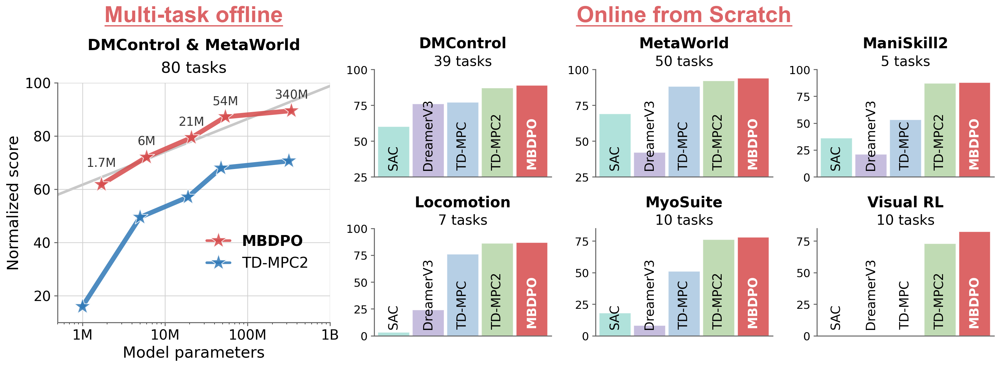

# MBDPO: Scaling World-Model Reinforcement Learning Through Diffusion Policy Optimization

Official implementation of **"Scaling World-Model Reinforcement Learning Through Diffusion Policy Optimization"** by

**Xiaoyuan Cheng*** (ucesxc4@ucl.ac.uk), **Wenxuan Yuan*** (YUAN0186@e.ntu.edu.sg), Zhancun Mu, Yuanzhao Zhang, Yiming Yang, Hai Wang, Zhuo Sun<sup>†</sup>, Che Liu<sup>†</sup>


<p align="center">
  <a href="https://wenxuan52.github.io/mbdpo-page/"></a>
  <a href="https://arxiv.org/abs/2605.26282"></a>
  <a href="https://huggingface.co/BruceYuan/MBDPO"></a>
  <a href="https://github.com/Edmond1Cheng/MBDPO/blob/main/LICENSE"></a>
  
</p>

## Overview

**MBDPO** is a model-based reinforcement learning framework that **unifies search and policy optimization** through a diffusion policy representation inside a learned latent world model. Instead of building an explicit planner (e.g. MPPI) on top of the world model, MBDPO reformulates policy optimization as a diffusion process over imagined trajectories, where the score field is corrected by model-based returns and anchored to the behavior distribution via an implicit energy function. This eliminates the structural misalignment between search and value learning that limits prior world-model approaches, and yields **monotonic scaling** of performance with model capacity.



The repository contains code for training and evaluating MBDPO across **121 continuous control tasks** in three settings: **online from scratch**, **multi-task offline pretraining**, and **offline-to-online (O2O) fine-tuning**.

## Getting started

### Environment

We provide ready-to-use Conda environment files for different experiment suites.

```bash
# Example: create environment for MT80 experiments
conda env create -f conda_envs/mbdpo-mt80.yml
conda activate mbdpo-mt80

# Optional: other provided environments
# conda env create -f conda_envs/mbdpo-ms2.yml
# conda env create -f conda_envs/mbdpo-myo.yml
```

See notes for each environment in this [link](conda_envs/README.md)

### Offline Pretraining Dataset

For multi-task offline pretraining, we use the replay buffer results from open-sourced TD-MPC2 dataset ([mt80](https://huggingface.co/datasets/nicklashansen/tdmpc2/tree/main/mt80) & [mt30](https://huggingface.co/datasets/nicklashansen/tdmpc2/tree/main/mt30)).

To download (remember to adjust the dataset path accordingly in configuration yaml files):

- **mt30**:

```bash
mkdir -p ./offline_dataset/mt30

seq 0 3 | xargs -I {} -P 4 wget -c \
  -O ./offline_dataset/mt30/chunk_{}.pt \
  "https://huggingface.co/datasets/nicklashansen/tdmpc2/resolve/main/mt80/chunk_{}.pt?download=true"
```

- **mt80**:

```bash
mkdir -p ./offline_dataset/mt80

seq 0 19 | xargs -I {} -P 4 wget -c \
  -O ./offline_dataset/mt80/chunk_{}.pt \
  "https://huggingface.co/datasets/nicklashansen/tdmpc2/resolve/main/mt80/chunk_{}.pt?download=true"
```

## Supported tasks

This codebase provides support for all **121** continuous control tasks from **DMControl** (39 tasks), **MetaWorld** (50 tasks), **ManiSkill2** (5 tasks), **MyoSuite** (10 tasks), **Locomotion** (7 tasks), and **Visual RL** (10 tasks) used in our technical report. In the DMControl domain, we use the 11 custom tasks followed the setting from [TD-MPC2](https://github.com/nicklashansen/tdmpc2).

See this [link](results/README.md) for more detailed tasks and notes in each domain.

## Example usage

### 1) Single-task online from scratch

```bash
python scripts/train.py task=dog-run seed=1 steps=4000000
```

or in the parallel launcher

```bash
python scripts/online_parallel_train.py --config cfgs/online_parallel_config.yaml
```

### 2) Multi-task offline pretraining

```bash
python scripts/train.py task=mt80 multitask=true
# or
python scripts/train.py task=mt30 multitask=true
```

### 3) Offline-to-online (O2O) fine-tuning

```bash
python scripts/offline_to_online.py \
  checkpoint=/path/to/checkpoint.pt \
  save_path=/path/to/output_dir \
  off2on_task="walker-run" \
  steps=40000
```

### 4) Evaluation

```bash
python scripts/evaluate.py \
  task=mt80 \
  checkpoint=/path/to/checkpoint.pt \
  eval_episodes=10
```

About parameter usage, please refer to this [description](cfgs/README.md)

## Citation

```
@misc{cheng2026scalingworldmodelreinforcementlearning,
      title={Scaling World-Model Reinforcement Learning Through Diffusion Policy Optimization}, 
      author={Xiaoyuan Cheng and Wenxuan Yuan and Zhancun Mu and Yuanzhao Zhang and Yiming Yang and Hai Wang and Zhuo Sun and Che Liu},
      year={2026},
      eprint={2605.26282},
      archivePrefix={arXiv},
      primaryClass={cs.LG},
      url={https://arxiv.org/abs/2605.26282}, 
}
```

## Contributing

Contributions are welcome — bug reports, questions, feature requests, and pull
requests all help. To get started, please open an
[issue](https://github.com/Edmond1Cheng/MBDPO/issues) or submit a pull request.

For details on reporting bugs, the pull request process, and code style, see
[CONTRIBUTING.md](CONTRIBUTING.md). For questions about the paper itself, feel
free to contact Xiaoyuan Cheng: ucesxc4@ucl.ac.uk and Wenxuan Yuan: YUAN0186@e.ntu.edu.sg.

## License

This project is released under the [MIT License](LICENSE).

Note that this repository depends on third-party code and simulators
(DMControl, Meta-World, ManiSkill2, MyoSuite, etc.), which are subject to
their own respective licenses.
