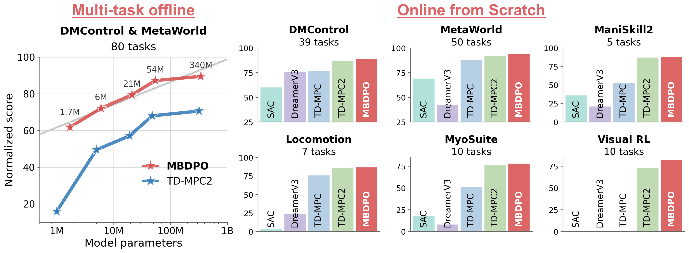

# MBDPO: Scaling World-Model Reinforcement Learning Through Diffusion Policy Optimization

Official implementation of **"Scaling World-Model Reinforcement Learning Through Diffusion Policy Optimization"** by

**Xiaoyuan Cheng*** (ucesxc4@ucl.ac.uk), **Wenxuan Yuan*** (YUAN0186@e.ntu.edu.sg), Zhancun Mu, Yuanzhao Zhang, Yiming Yang, Hai Wang, Zhuo Sun<sup>†</sup>, Che Liu<sup>†</sup>


<p align="center">
  <a href="https://wenxuan52.github.io/mbdpo-page/"></a>
  <a href="https://arxiv.org/abs/2605.26282"></a>
  <a href="https://huggingface.co/BruceYuan/MBDPO"></a>
  <a href="https://github.com/Edmond1Cheng/MBDPO/blob/main/LICENSE"></a>
  
</p>

## Overview

**MBDPO** is a model-based reinforcement learning framework that **unifies search and policy optimization** through a diffusion policy representation inside a learned latent world model. Instead of building an explicit planner (e.g. MPPI) on top of the world model, MBDPO reformulates policy optimization as a diffusion process over imagined trajectories, where the score field is corrected by model-based returns and anchored to the behavior distribution via an implicit energy function. This eliminates the structural misalignment between search and value learning that limits prior world-model approaches, and yields **monotonic scaling** of performance with model capacity.



The repository contains code for training and evaluating MBDPO across **121 continuous control tasks** in three settings: **online from scratch**, **multi-task offline pretraining**, and **offline-to-online (O2O) fine-tuning**.

## JAX Implementation Branch

This branch replaces the main package implementation with high-performance JAX
code while keeping the same top-level structure: `MBDPO/mbdpo.py`,
`MBDPO/diffusion.py`, and `MBDPO/common/world_model.py` are JAX implementations.
The older side-by-side `jax_impl` package is not part of this branch.

Current validation status:

- Implemented paths: state and rgb world-model components, diffusion planner,
  reward/value/consistency/contrastive/termination/score losses, offline sampler,
  single-device JIT update, and `pmap + pmean` data-parallel update.
- Validated paths: single-task state online on `cheetah-run`, fixed-replay
  reference/JAX loss comparisons, one extracted `cheetah-run-back` offline dataset,
  synthetic rgb/episodic/score/multitask checks, and pmap correctness.
- Not yet validated as a full paper reproduction: all 121 tasks, full MT30/MT80
  final quality, O2O fine-tuning quality, visual closed-loop training, and
  hundred-GPU scale.

Representative speed and alignment results are indexed in
[`results/jax_implementation/`](results/jax_implementation/README.md):

- JAX update weak scaling: `95,462 samples/s` on 1 GPU at batch 1024 and
  `380,783 samples/s` on 4 GPUs at batch 4096, a `3.99x` throughput scale-up.
- Fixed-replay online comparison on `cheetah-run` over 10k updates and 3 seeds:
  JAX final update mean `18.54ms` vs Torch `37.69ms`; end-to-end wall-clock
  `607.36s` vs `2930.48s`.
- Compressed paper-style online run on `cheetah-run`, seed 81: 50k eval reward
  matched closely (JAX `542.309`, Torch `541.7`); 100k eval reward was JAX
  `766.558` vs Torch `708.6`.
- Compressed offline same-data run on `cheetah-run-back`, seed 82: JAX final
  update `50.572ms` vs Torch `78.225ms`; final eval reward was JAX `135.839`
  vs Torch `159.704`.

Treat these as implementation validation results, not as the paper's complete
benchmark table.

## Highlight Visualization


<b>MBDPO</b> learns structured latent trajectories across locomotion and manipulation tasks. Cyclic behaviors form closed-loop patterns, while goal-directed tasks produce smooth trajectories toward successful completion.


<p align="center">
  <b>DMControl</b>
</p>

<div align="center">
<table>
  <tr>
    <td align="center" width="25%">
      <b>Cheetah Run Front</b><br>
      <br>
      Reward: 740.7
    </td>
    <td align="center" width="25%">
      <b>Cup Spin</b><br>
      <br>
      Reward: 840.4
    </td>
    <td align="center" width="25%">
      <b>Reacher Hard</b><br>
      <br>
      Reward: 985.0
    </td>
    <td align="center" width="25%">
      <b>Walker Run</b><br>
      <br>
      Reward: 769.2
    </td>
  </tr>
</table>
</div>

<p align="center">
  <b>MetaWorld</b>
</p>

<div align="center">
<table>
  <tr>
    <td align="center" width="25%">
      <b>Bin Picking</b><br>
      <br>
      Reward: 1585.0<br>
      Success Rate: 1.00
    </td>
    <td align="center" width="25%">
      <b>Disassemble</b><br>
      <br>
      Reward: 1556.2<br>
      Success Rate: 1.00
    </td>
    <td align="center" width="25%">
      <b>Door Close</b><br>
      <br>
      Reward: 1549.1<br>
      Success Rate: 1.00
    </td>
    <td align="center" width="25%">
      <b>Lever Pull</b><br>
      <br>
      Reward: 1664.9<br>
      Success Rate: 0.90
    </td>
  </tr>
</table>
</div>

## Getting started

### Environment

We provide ready-to-use Conda environment files for different experiment suites.

```bash
# JAX implementation environment
conda env create -f conda_envs/mbdpo-jax.yml
conda activate mbdpo-jax
```

See notes for each environment in this [link](conda_envs/README.md)

### Offline Pretraining Dataset

For multi-task offline pretraining, this pure JAX branch expects NumPy `.npz`
chunks. Each chunk should contain `obs`, `action`, `reward`, optional
`terminated`, and optional `task` arrays. Raw binary chunks are local experiment
artifacts and are intentionally not committed.

## Supported tasks

This codebase provides support for all **121** continuous control tasks from **DMControl** (39 tasks), **MetaWorld** (50 tasks), **ManiSkill2** (5 tasks), **MyoSuite** (10 tasks), **Locomotion** (7 tasks), and **Visual RL** (10 tasks) used in our technical report. In the DMControl domain, we use the 11 custom tasks followed the setting from [TD-MPC2](https://github.com/nicklashansen/tdmpc2).

See this [link](results/README.md) for more detailed tasks and notes in each domain.

## Example usage

### 1) Single-task online from scratch

```bash
python scripts/train.py task=dog-run seed=1 steps=4000000
```

### 2) Multi-task offline pretraining

```bash
python scripts/train.py task=mt80 data_dir=/path/to/mt80_npz_chunks
# or
python scripts/train.py task=mt30 data_dir=/path/to/mt30_npz_chunks
```

### 3) Benchmarks and correctness checks

```bash
# Compiled update/planner benchmark
python scripts/jax_benchmark.py --data-parallel-devices 4 --data-parallel-batch-size 4096

# Multi-device pmap correctness check
python scripts/jax_parallel_correctness.py --devices 4 --batch-size 128
```

The JAX implementation has not been validated on every paper task. See
[`results/jax_implementation/`](results/jax_implementation/README.md) for the
tested scope and current speed/alignment results.

### 4) Evaluation

```bash
python scripts/train.py task=cheetah-run steps=0 eval_freq=1 eval_episodes=10
```

About parameter usage, please refer to this [description](cfgs/README.md)

## Citation

```
@misc{cheng2026scalingworldmodelreinforcementlearning,
      title={Scaling World-Model Reinforcement Learning Through Diffusion Policy Optimization}, 
      author={Xiaoyuan Cheng and Wenxuan Yuan and Zhancun Mu and Yuanzhao Zhang and Yiming Yang and Hai Wang and Zhuo Sun and Che Liu},
      year={2026},
      eprint={2605.26282},
      archivePrefix={arXiv},
      primaryClass={cs.LG},
      url={https://arxiv.org/abs/2605.26282}, 
}
```

## Contributing

Contributions are welcome — bug reports, questions, feature requests, and pull
requests all help. To get started, please open an
[issue](https://github.com/Edmond1Cheng/MBDPO/issues) or submit a pull request.

For details on reporting bugs, the pull request process, and code style, see
[CONTRIBUTING.md](CONTRIBUTING.md). For questions about the paper itself, feel
free to contact Xiaoyuan Cheng: ucesxc4@ucl.ac.uk and Wenxuan Yuan: YUAN0186@e.ntu.edu.sg.

## License

This project is released under the [MIT License](LICENSE).

Note that this repository depends on third-party code and simulators
(DMControl, Meta-World, ManiSkill2, MyoSuite, etc.), which are subject to
their own respective licenses.
